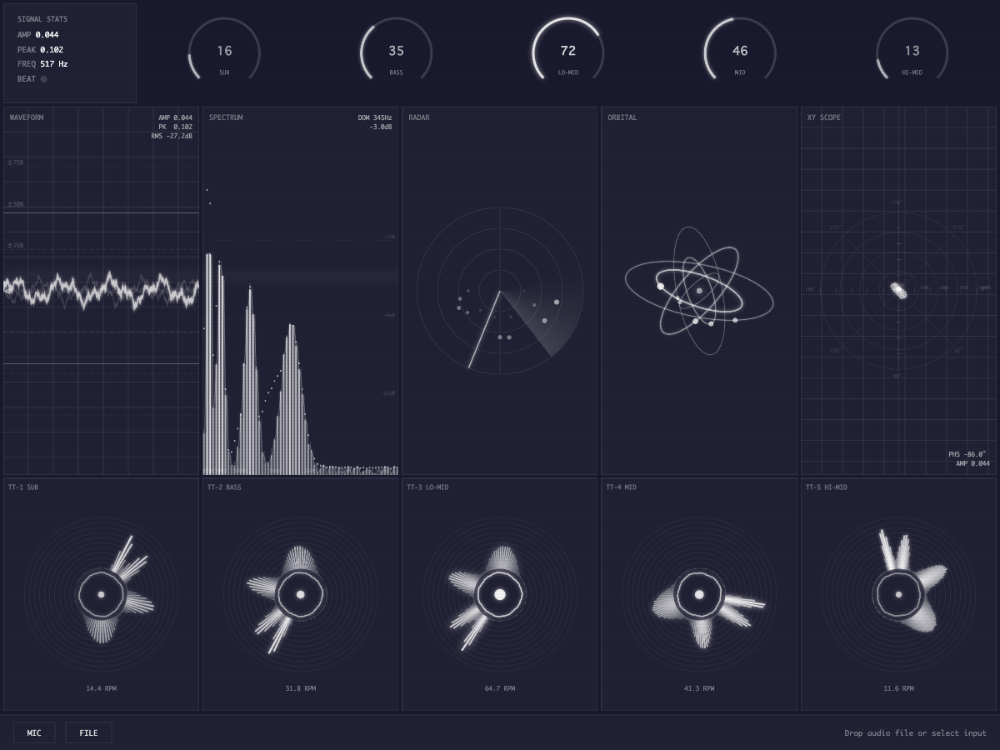

# 🚀 Beautiful Dashboard for BGA

宇宙船のコックピットのようなオーディオビジュアライザー・ダッシュボード 🛸

音声入力がなくても自動アニメーションで動き続けるモックモード搭載。マイクや音声ファイルを接続すれば、リアルタイムで音に反応します。

## 🌌 Live Demo

**👉 [https://takahiro-saeki.github.io/beautiful-dashboard-for-bga/](https://takahiro-saeki.github.io/beautiful-dashboard-for-bga/)**

## 🛰️ Screenshot



## ✨ Features

- 🎛️ **15+ ウィジェット** — 波形、スペクトラム、レーダー、オービタル、XYスコープ、ターンテーブル×5 など
- 🔊 **リアルタイム音声解析** — マイク入力 or 音声ファイルに対応
- 🤖 **モックモード** — 音声なしでも全ウィジェットが自動アニメーション
- 📊 **マシン感のある計器UI** — ピークホールド、ゴースト波形、dB閾値線、位相リードアウトなど
- 🎚️ **5帯域ターンテーブル** — SUB / BASS / LO-MID / MID / HI-MID が独立回転

## 🪐 Tech Stack

- React + TypeScript
- Vite
- Canvas API (全描画)
- Web Audio API (音声解析)

## 🚀 Getting Started

```bash
npm install
npm run dev
```

ブラウザで開けばモックモードで自動的にアニメーションが始まります。

MIC ボタンでマイク入力、FILE ボタンで音声ファイルを読み込めます。
